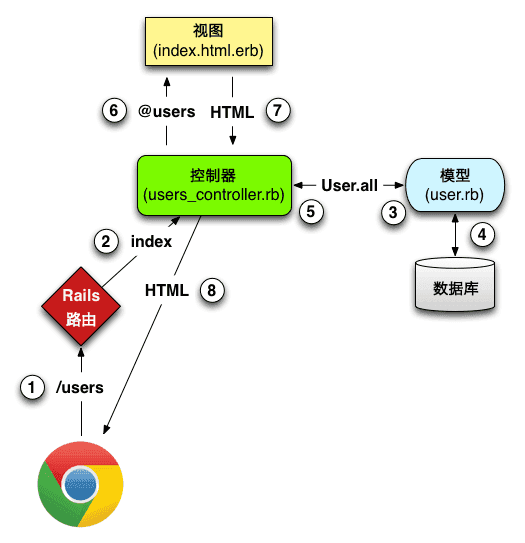

#从输入url到页面展现的过程
###1.在浏览器里输入URL
###2.域名解析
浏览器通过DNS查找这个域名对应的IP地址，域名解析流程,逐级寻找直到找到为止：
1.通过浏览器缓存查找：浏览器会缓存之前用过的DNS一段时间。
2.通过系统缓存查找：从Host文件查找是否有该域名对应的IP。
3.通过路由器缓存查找：一般路由器里也会缓存域名的IP。
4.通过ISPDNS缓存里查找：也就是对应运营商服务器里查找。
5.在根域名服务器里查找域名对应的IP。
###3.服务器处理
找到对应的IP后，浏览器会向web服务器发送HTTP请求，web服务器接受用户的请求，并返回一个HTTP响应。
###4.网站处理
网站处理，就是实际后台处理的工作。后台开发现在有很多框架，但大部分还是按照MVC设计模式进行搭建的。MVC是一个设计模式，将应用程序分成三个核心部件：模型（model）--视图（view）--控制器（controller），他们各自处理自己的任务，实现输入、处理和输出。

1.视图（view） 视图是用户看到并与之交互的界面，是前端工作的主力部分。 
2.模型（model） 模型是将实际开发中的业务规则和所涉及的数据格式模型化，应用于模型的代码只需写一次就以被多个视图使用。在MVC的三个部件中，模型拥有最多的处理任务，一个模型能为多个视图提供数据。 
3.控制器（controller） 控制器接受服务器传送过来的用户输入并调用模型和视图去完成用户需求。Controller处于管理角色，从视图接受请求并决定调用哪儿个模型构件去处理请求，然后在确定用哪儿个视图来显示模型处理返回的数据。
###5.浏览器处理并绘制网页
通过后台处理返回的代码，会被浏览器读取解析，然后绘制渲染出我们看到的网页。
